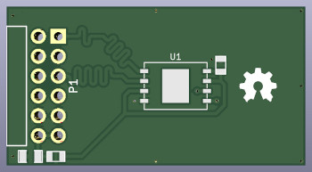
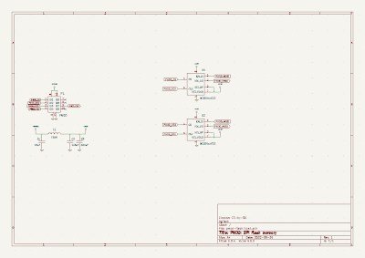
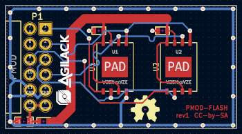

PMOD Flash memory
=================

CAD sources
-----------

This board has been designed using KiCad EDA (version 6). All sources files
(schematics, routing, ...) are available into the `prj-kicad` folder. 

<table>
<tr>
<td></td>
<td></td>
</tr>
<tr>
<td>Fig1: Preview of the KiCad schematics</td>
<td>Fig2: Preview of the KiCad routing</td>
</tr>
</table>

License
-------

This project is OpenHardware. You can use (and/or modify) this project under
terms of the Creative Commons ShareAlike license (CC-by-SA).
See [LICENSE.md](LICENSE.md).
